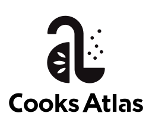

# About Me

I am the Co-founder & CTO of [Cooks Atlas](https://www.cooksatlas.com/) where we're building a new kind of recipe site & community challenging what it's like to explore food content online.

I believe that the point of tools is to serve people's goals and needs, and so centering the people and their challenges is crucial in everything we build in today's world, whether that be products, workflows, or politics.

## Interests

- 🍴 I love to cook & explore new cuisines. If you love a food, I'd love to hear about it!
- 🗣️ I'm fluent in French (from 🇧🇪) and Spanish (from 🏫)
- 🛠️ I'm an open source maintainer and contributor with a passion for good user and developer experiences.
- 🦀 [Rust](rust-lang.org) fan
- 🕊️ [Swift](swift.org) fan
- ⌨️ [TypeScript](https://www.typescriptlang.org) fan
- 💪🏼 Strongly-typed programming languages are great for teams

## Other

- Pronouns: He/Him
- Timezone: America/Los Angeles
- Preferred Coding Languages:
